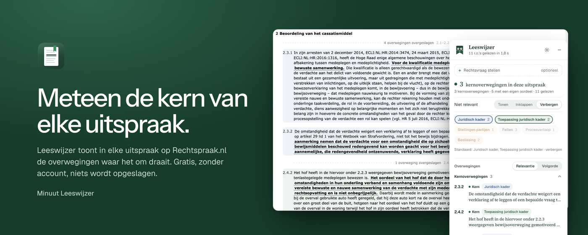
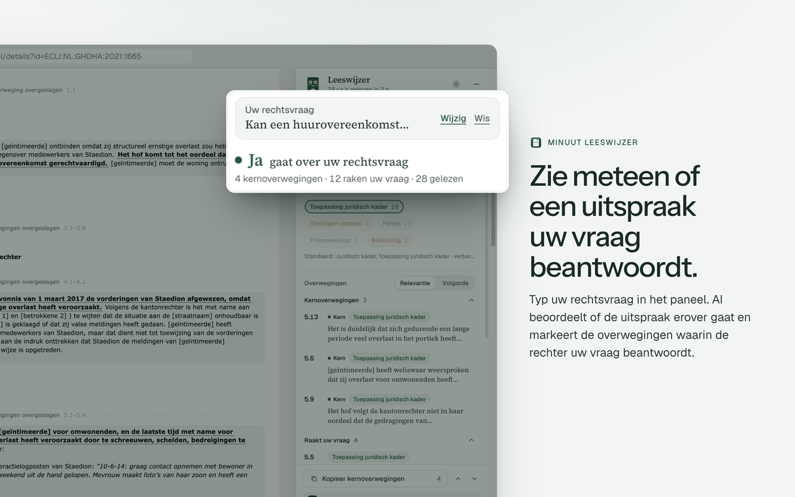
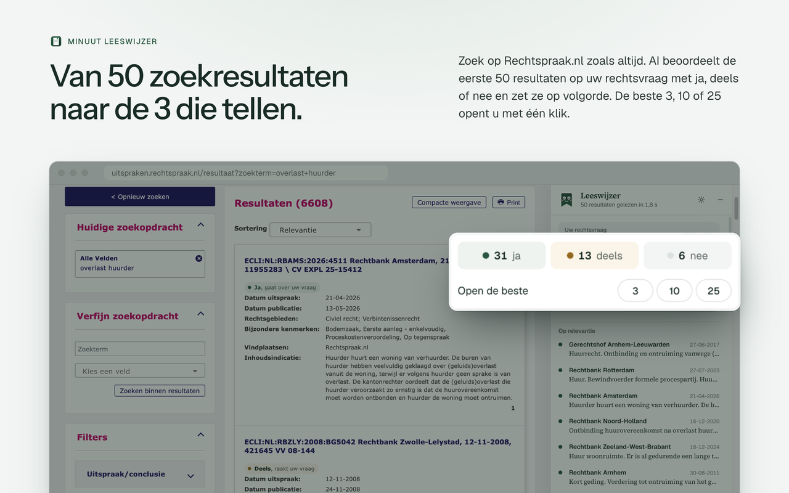

  

<h1 align="center">Minuut Leeswijzer</h1>

  Een Chrome-extensie die in elke uitspraak op Rechtspraak.nl meteen de kernoverwegingen laat zien. 
  Gratis, zonder account, niets wordt opgeslagen.

  <a href="https://chromewebstore.google.com/detail/minuut-leeswijzer/djlkngghkpadabjgmegaeelmffhhljfe?hl=nl"><b>Installeren uit de Chrome Web Store</b></a>
  &nbsp;·&nbsp;
  <a href="https://minuut.eu/leeswijzer/">Website</a>
  &nbsp;·&nbsp;
  <a href="https://minuut.eu/leeswijzer/privacy/">Privacy</a>

---

Een uitspraak lezen kost tijd. De overwegingen waar het echt om draait, staan vaak
tussen pagina's feiten, stellingen en procesverloop. Leeswijzer leest de hele uitspraak
mee en toont de overwegingen die ertoe doen: de maatstaf van de rechter en hoe die wordt
toegepast. De rest wordt ingeklapt en is met één klik terug te halen.

## Wat het doet

**De kern van elke uitspraak.** Open een uitspraak en Leeswijzer markeert de
kernoverwegingen. Met <kbd>j</kbd> en <kbd>k</kbd> spring je van de ene naar de volgende,
en de belangrijkste zin van elke overweging wordt onderstreept.

**Antwoord op een rechtsvraag.** Typ een rechtsvraag in het paneel en Leeswijzer laat per
uitspraak zien of die erover gaat, en in welke overwegingen de rechter de vraag beantwoordt.

**Van 50 zoekresultaten naar de paar die tellen.** Zoek zoals altijd. Leeswijzer beoordeelt
de eerste 50 resultaten met ja, deels of nee, zet ze op volgorde en opent de beste 3, 10 of
25 in één keer.

## De tekst blijft van de rechter

Leeswijzer schrijft niets. Het AI-model beoordeelt alleen welke overwegingen relevant zijn;
de extensie verandert kleur, volgorde en zichtbaarheid. Wat je leest, is altijd de
oorspronkelijke tekst van de uitspraak. Het model kan zich vergissen, dus controleer wat je
gebruikt.

## Privacy

- **Niets bewaard op de server.** De server van Minuut geeft een verzoek alleen door aan het
  AI-model en slaat geen vragen, uitspraken of gebruik op.
- **Zero data retention bij het model.** De inhoud wordt niet bewaard en niet gebruikt om
  modellen te trainen.
- **Alleen deze browsersessie.** De rechtsvraag en de oordelen verdwijnen als de browser
  sluit. Alleen weergavekeuzes, zoals inklappen, blijven bewaard.
- **Wat er verstuurd wordt:** de rechtsvraag en de openbare tekst van de uitspraak. Zet
  daarom geen cliëntgegevens in de rechtsvraag.

Omdat de code open is, is dit na te lezen. Alles wat de extensie verstuurt, gaat via
[`src/background.js`](src/background.js). Wat de server ermee doet, staat in
[`worker/src/index.js`](worker/src/index.js): de vaste vragen aan het AI-model, de limieten,
zero data retention, en dat er niets wordt opgeslagen of gelogd.

## Meebouwen

De extensie is gewone JavaScript en CSS, zonder build-stap of dependencies. Laad deze map
via `chrome://extensions` → *Uitgepakte extensie laden*. Hoe je de server lokaal draait en
waar alles zit, staat in [CONTRIBUTING.md](CONTRIBUTING.md).

Bugs, uitspraken die verkeerd worden ingedeeld en ideeën zijn welkom als
[issue](../../issues).

## Over Minuut

Leeswijzer is gemaakt door [Minuut](https://minuut.eu/?ref=leeswijzer-github), juridische
AI voor Nederlandse advocaten. Minuut betaalt de AI-aanroepen, zodat de extensie gratis is.

## Licentie

De code valt onder de [MIT-licentie](LICENSE). De lettertypen in `fonts/` (Geist en Source
Serif 4) vallen onder de SIL Open Font License 1.1. De naam Minuut en het logo vallen niet
onder de MIT-licentie.
